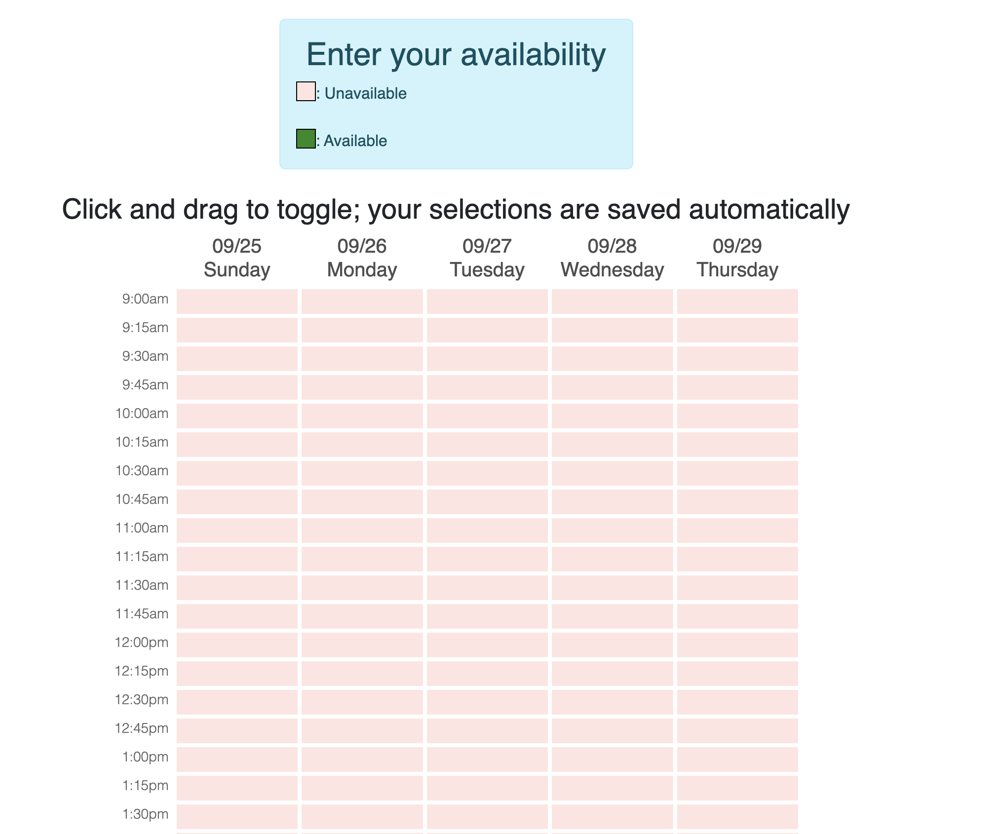

# when2meet-app

You can view the doodle prototype at this [link](https://pcsong33.github.io/when2meet/).

The distinguishing feature of When2Meet that we wanted to implement in this Minimum User-Testable Implementation is the ability to paint over times. This contrasts from Doodle's manual selection of times by clicking on individual slots.

The primary reason why When2Meet implemented the "paint over" feature rather than just clicking on individual slots is because of how When2Meet envisions users using the application. Specifically, a When2Meet organizer will propose a general time span of availabilies (a time range over multiple days). The organizer and any users that they send the the When2Meet to will then "paint over" any times that they are available to meet. In this case, outside of the initial constraints, all users (organizer or not) are treated equally whereas in Doodle, the organizer specifies all possible time slots that they want to make avaiable and so the users can only select which slots they would like to choose.

In that sense, it can be easy to envision When2Meet being more useful to find possible meeting times and Doodle being more useful for appointment bookings.

### App Features
- View a list of possible times for meetings
- "Paint over" the available times with your own availability.
- You're only able to submit the form if at least one availability has been selected

Note that in the official When2Meet App, users are able to see a heat map of the availability of anyone that has filled out the When2Meet so far. For the purposes of this implementation, we won't be replicating this feature.
